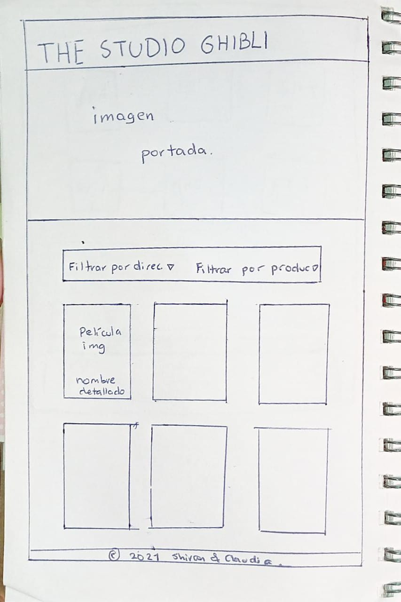
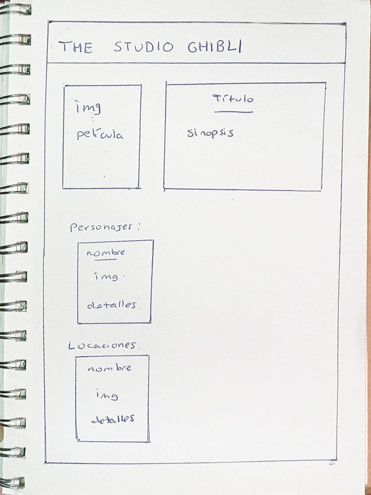
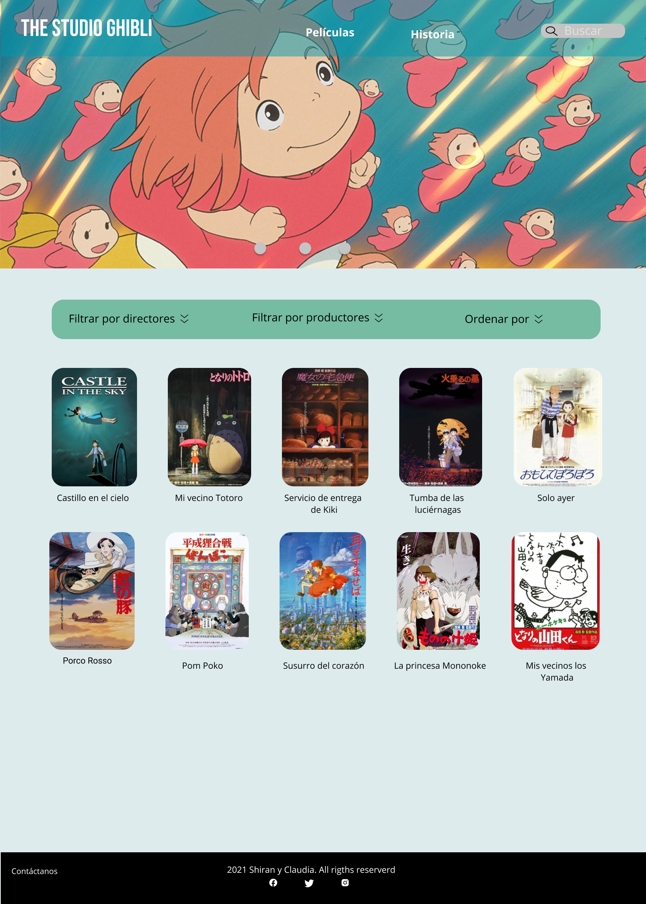

# Data Lovers - Studio Ghibli

## Índice

* [1. Resumen del Proyecto](#1-resumen-del-proyecto)
* [2. Historias de usuario](#2-historias-de-usuario)
* [3. Diseño de la interfaz](#3-diseño-de-la-interfaz)

***

## 1. Resumen del proyecto 📃
Studio Ghibli es un estudio de animación japonés, conocido por sus largometrajes
animados considerados grandes éxitos.

Las animaciones tienen gran acogida a nivel mundial y algunas han recibido
varias nominaciones y premios. De todo este fandom hay un grupo que desea poder
interactuar y ver la información de las animaciones y sus personajes.

Debido a esto, se vio la necesidad de poder elaborar un producto digital en el 
cual se pueda consolidar la información relacionada a los largometrajes y le permita 
al usuario obtener la informacion de estos de forma dinámica y de acuerdo a sus 
necesidades.

## 2. Historias de Usuario 🔖

  🎈 HU 1

     Como: usuaria  
     Quiero: saber cuantas animaciones y cuales son  
     Para: poder diferenciarlas y obetener la informacion de la que estoy buscando  
     
     Definición de terminado:
     Terminar de realizar un prototipo de baja fidelidad de la primera vista,
     ordenar como queremos que se muestren las animaciones
     comenzar la maquetación en HTML y CSS.

  🎈 HU 2

     Como: usuaria  
     Quiero: poder filtrar las animaciones de acuerdo a directores y productores  
     Para: conocer cuántas y cuáles animaciones hicieron  
     
     Definición de terminado:  
     Colocar los dropdowns en la primera vista, realizar las funciones de filtrado  
     y poder llamar la animaciones y mostrarlas en la vista principal.

  🎈 HU 3

    Como:usuaria  
    Quiero: ordenar las animaciones por año de publicacion y por nombre de la A-Z o viceversa  
    Para: poder encontrar las animaciones más rápido y obtener su información  
    
    Definición de terminado:  
    Colocar el dropdown de ordenamiento, realizar las funciones de ordenar tanto por año y por titulo,  
    llamar y mostrarlas en la vista principal.

  🎈 HU 4

    Como:usuaria  
    Quiero: poder actualizar/reiniciar mis filtros y ordenamientos
    Para: poder encontrar las animaciones más rápido  
    
    Definición de terminado:  
    Colocar un botón de refresh para limpiar los filtros.

  🎈 HU 5
  
    Como: usuaria  
    Quiero: poder ver detalles de cada animación (descripción, fecha de lanzamiento, director, productor y personajes.)  
    Para: poder encontrar la información detallada de cada animación.  
    
    Definición de terminado:  
    Desarrollar el prototipo de la 2da vista, poder mostrarla y ocultarla, poder incluir los detalles de la película además de su imagen de portada

  🎈 HU 6

    Como: usuaria   
    Quiero: poder ver los personajes de cada animación, saber cuántos y cuáles son, además de sus datos (nombre, edad, género, etc)  
    Para: tener la información detallada de cada película   
   
    Definición de terminado:  
     En la 2da vista invocar las imágenes de los personajes con sus datos y ordenarlos.

  🎈 HU 7

    Como: usuaria  
    Quiero: poder ver las locaciones y vehículos, saber cuántos y cuáles son, además de sus datos.   
    Para: tener la información detallada de cada locación y vehículo.   
   
    Definición de terminado:  
    En la 2da vista incluir las imágenes de las locaciones y vehículos con sus datos para ordenarlos.
  
## 3. Diseño de la Interfaz de Usuario 🔖

#### Prototipo de baja fidelidad ✨

 Sketchs iniciales en papel de nuestras vistas y cómo ordenar nuestra información  

 

 

#### Prototipo de alta fidelidad ✨

Desarrollamos un prototipo de alta fidelidad en Figma de acuerdo a cómo queríamos representar 
nuestra página.

#### Testeos de usabilidad

Durante el reto consultamos y pedimos feedback a nuestras compañeras, en cuanto ordenamiento, 
colores, fuentes, uso de imágenes y formas, todo ello hizo que cambiaramos lo que fue nuestro 
prototipo inicial al de alta fidelidad para finalmente trasaladarlo al código. 

Hemos recibido buenas críticas, ya que el prototipo y la página web tienen mucha similitud, uno de nuestros cambios fue el footer: quitamos enlaces, en cuánto al buscador lo añadimos,
colocamos enlaces en el header como el 'home', decidimos que visualmente sea en inglés, ya que inicialmente estaba 
en 2 idiomas.

### Implementación de la Interfaz de Usuario (HTML/CSS/JS)

Vista final de nuestro proyecto al cierre del 4to sprint 🎊

